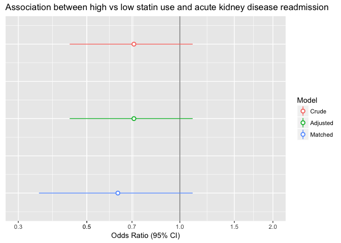

SynPUF-propensity-model
================
Erika Braithwaite
2018-05-23

First select individuals above 40 at the time they first showed up in the dataset; then exclude anyone died within one year; then select individuals with statin prescription after 2009-01-01 (set first prescription date as cohort entry date); then exclude anyone who took lipid-lowering drugs before 2009-01-01; also exclude anyone who had dialysis one year before cohort entry

### Table 1. Covariate balance in total sample N = 839

<table>
<thead>
<tr>
<th style="text-align:left;">
</th>
<th style="text-align:center;">
low statin
</th>
<th style="text-align:center;">
high statin
</th>
<th style="text-align:center;">
SMD
</th>
</tr>
</thead>
<tbody>
<tr>
<td style="text-align:left;">
n
</td>
<td style="text-align:center;">
6425
</td>
<td style="text-align:center;">
1036
</td>
<td style="text-align:center;">
</td>
</tr>
<tr>
<td style="text-align:left;">
hypertension = Yes (%)
</td>
<td style="text-align:center;">
2214 (34.5)
</td>
<td style="text-align:center;">
375 (36.2)
</td>
<td style="text-align:center;">
0.036
</td>
</tr>
<tr>
<td style="text-align:left;">
hypercholesterol = Yes (%)
</td>
<td style="text-align:center;">
1607 (25.0)
</td>
<td style="text-align:center;">
285 (27.5)
</td>
<td style="text-align:center;">
0.057
</td>
</tr>
<tr>
<td style="text-align:left;">
heart.failure = Yes (%)
</td>
<td style="text-align:center;">
732 (11.4)
</td>
<td style="text-align:center;">
105 (10.1)
</td>
<td style="text-align:center;">
0.041
</td>
</tr>
<tr>
<td style="text-align:left;">
PVD = Yes (%)
</td>
<td style="text-align:center;">
126 ( 2.0)
</td>
<td style="text-align:center;">
22 ( 2.1)
</td>
<td style="text-align:center;">
0.011
</td>
</tr>
<tr>
<td style="text-align:left;">
injury.poison = Yes (%)
</td>
<td style="text-align:center;">
991 (15.4)
</td>
<td style="text-align:center;">
167 (16.1)
</td>
<td style="text-align:center;">
0.019
</td>
</tr>
<tr>
<td style="text-align:left;">
hospital = Yes (%)
</td>
<td style="text-align:center;">
947 (14.7)
</td>
<td style="text-align:center;">
171 (16.5)
</td>
<td style="text-align:center;">
0.049
</td>
</tr>
<tr>
<td style="text-align:left;">
lab.test = Yes (%)
</td>
<td style="text-align:center;">
3168 (49.3)
</td>
<td style="text-align:center;">
526 (50.8)
</td>
<td style="text-align:center;">
0.029
</td>
</tr>
</tbody>
</table>
### Estimate propensity score with nearest neighbor 1:1 matching

``` r
model = matchit(statin ~ hypertension + hypercholesterol + heart.failure + 
                injury.poison + hospital + lab.test, method = 'nearest', data = dat)

kable(model$nn)
```

<table>
<thead>
<tr>
<th style="text-align:left;">
</th>
<th style="text-align:right;">
Control
</th>
<th style="text-align:right;">
Treated
</th>
</tr>
</thead>
<tbody>
<tr>
<td style="text-align:left;">
All
</td>
<td style="text-align:right;">
6425
</td>
<td style="text-align:right;">
1036
</td>
</tr>
<tr>
<td style="text-align:left;">
Matched
</td>
<td style="text-align:right;">
1036
</td>
<td style="text-align:right;">
1036
</td>
</tr>
<tr>
<td style="text-align:left;">
Unmatched
</td>
<td style="text-align:right;">
5389
</td>
<td style="text-align:right;">
0
</td>
</tr>
<tr>
<td style="text-align:left;">
Discarded
</td>
<td style="text-align:right;">
0
</td>
<td style="text-align:right;">
0
</td>
</tr>
</tbody>
</table>
### Pruned data

<table>
<thead>
<tr>
<th style="text-align:left;">
</th>
<th style="text-align:center;">
low statin
</th>
<th style="text-align:center;">
high statin
</th>
<th style="text-align:center;">
SMD
</th>
</tr>
</thead>
<tbody>
<tr>
<td style="text-align:left;">
n
</td>
<td style="text-align:center;">
1036
</td>
<td style="text-align:center;">
1036
</td>
<td style="text-align:center;">
</td>
</tr>
<tr>
<td style="text-align:left;">
hypertension = Yes (%)
</td>
<td style="text-align:center;">
375 (36.2)
</td>
<td style="text-align:center;">
375 (36.2)
</td>
<td style="text-align:center;">
&lt;0.001
</td>
</tr>
<tr>
<td style="text-align:left;">
hypercholesterol = Yes (%)
</td>
<td style="text-align:center;">
285 (27.5)
</td>
<td style="text-align:center;">
285 (27.5)
</td>
<td style="text-align:center;">
&lt;0.001
</td>
</tr>
<tr>
<td style="text-align:left;">
heart.failure = Yes (%)
</td>
<td style="text-align:center;">
105 (10.1)
</td>
<td style="text-align:center;">
105 (10.1)
</td>
<td style="text-align:center;">
&lt;0.001
</td>
</tr>
<tr>
<td style="text-align:left;">
PVD = Yes (%)
</td>
<td style="text-align:center;">
16 ( 1.5)
</td>
<td style="text-align:center;">
22 ( 2.1)
</td>
<td style="text-align:center;">
0.043
</td>
</tr>
<tr>
<td style="text-align:left;">
injury.poison = Yes (%)
</td>
<td style="text-align:center;">
167 (16.1)
</td>
<td style="text-align:center;">
167 (16.1)
</td>
<td style="text-align:center;">
&lt;0.001
</td>
</tr>
<tr>
<td style="text-align:left;">
hospital = Yes (%)
</td>
<td style="text-align:center;">
171 (16.5)
</td>
<td style="text-align:center;">
171 (16.5)
</td>
<td style="text-align:center;">
&lt;0.001
</td>
</tr>
<tr>
<td style="text-align:left;">
lab.test = Yes (%)
</td>
<td style="text-align:center;">
526 (50.8)
</td>
<td style="text-align:center;">
526 (50.8)
</td>
<td style="text-align:center;">
&lt;0.001
</td>
</tr>
</tbody>
</table>
### Comparing SMD between matched and unmatched sample

<table>
<thead>
<tr>
<th style="text-align:center;">
variable
</th>
<th style="text-align:center;">
unmatched sample
</th>
<th style="text-align:center;">
matched sample
</th>
</tr>
</thead>
<tbody>
<tr>
<td style="text-align:center;">
hypertension
</td>
<td style="text-align:center;">
0.04
</td>
<td style="text-align:center;">
0.00
</td>
</tr>
<tr>
<td style="text-align:center;">
hypercholesterol
</td>
<td style="text-align:center;">
0.06
</td>
<td style="text-align:center;">
0.00
</td>
</tr>
<tr>
<td style="text-align:center;">
heart.failure
</td>
<td style="text-align:center;">
0.04
</td>
<td style="text-align:center;">
0.00
</td>
</tr>
<tr>
<td style="text-align:center;">
PVD
</td>
<td style="text-align:center;">
0.01
</td>
<td style="text-align:center;">
0.04
</td>
</tr>
<tr>
<td style="text-align:center;">
injury.poison
</td>
<td style="text-align:center;">
0.02
</td>
<td style="text-align:center;">
0.00
</td>
</tr>
<tr>
<td style="text-align:center;">
hospital
</td>
<td style="text-align:center;">
0.05
</td>
<td style="text-align:center;">
0.00
</td>
</tr>
<tr>
<td style="text-align:center;">
lab.test
</td>
<td style="text-align:center;">
0.03
</td>
<td style="text-align:center;">
0.00
</td>
</tr>
</tbody>
</table>
### Distribution of standardized mean differences before and after matching


### Distribution of propensity scores in matched and unmatched sample


### Outcome models


