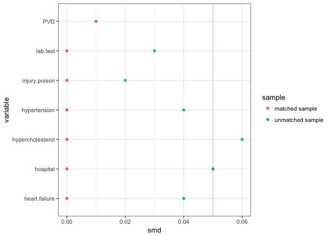

SynPUF-propensity-model
================
Erika Braithwaite
2018-05-23

Only 839 met the study's criteria:

First select individuals above 40 at the time they first showed up in the dataset; then exclude anyone died within one year; then select individuals with statin prescription after 2009-01-01 (set first prescription date as cohort entry date); then exclude anyone who took lipid-lowering drugs before 2009-01-01; also exclude anyone who had dialysis one year before cohort entry

### Table 1. Covariate balance in total sample N = 839

|                            | low statin | high statin |  SMD  |
|----------------------------|:----------:|:-----------:|:-----:|
| n                          |     710    |     133     |       |
| ckd = Yes (%)              |  66 ( 9.3) |  16 (12.0)  | 0.089 |
| hypertension = Yes (%)     | 256 (36.1) |  52 (39.1)  | 0.063 |
| hypercholesterol = Yes (%) | 183 (25.8) |  38 (28.6)  | 0.063 |
| heart.failure = Yes (%)    |  80 (11.3) |  13 ( 9.8)  | 0.049 |
| injury.poison = Yes (%)    | 119 (16.8) |  27 (20.3)  | 0.091 |
| hospital = Yes (%)         | 106 (14.9) |  26 (19.5)  | 0.123 |
| lab.test = Yes (%)         | 374 (52.7) |  77 (57.9)  | 0.105 |

### Estimate propensity score with nearest neighbor 1:1 matching

``` r
#model$call
```

``` r
model = matchit(statin ~ ckd + hypertension + hypercholesterol + heart.failure + 
                injury.poison + hospital + lab.test, method = 'nearest', data = dat)

kable(model$nn)
```

|           |  Control|  Treated|
|-----------|--------:|--------:|
| All       |      710|      133|
| Matched   |      133|      133|
| Unmatched |      577|        0|
| Discarded |        0|        0|

10 were successfully matched with controls

### Pruned data frame with 1:1

|                            | low statin | high statin |    SMD    |
|----------------------------|:----------:|:-----------:|:---------:|
| n                          |     133    |     133     |           |
| ckd = Yes (%)              |  16 (12.0) |  16 (12.0)  | &lt;0.001 |
| hypertension = Yes (%)     |  50 (37.6) |  52 (39.1)  |   0.031   |
| hypercholesterol = Yes (%) |  39 (29.3) |  38 (28.6)  |   0.017   |
| heart.failure = Yes (%)    |  13 ( 9.8) |  13 ( 9.8)  | &lt;0.001 |
| injury.poison = Yes (%)    |  25 (18.8) |  27 (20.3)  |   0.038   |
| hospital = Yes (%)         |  26 (19.5) |  26 (19.5)  | &lt;0.001 |
| lab.test = Yes (%)         |  77 (57.9) |  77 (57.9)  | &lt;0.001 |

### Comparing SMD between matched and unmatched sample

|     variable     | unmatched sample | matched sample |
|:----------------:|:----------------:|:--------------:|
|        ckd       |       0.09       |      0.00      |
|   hypertension   |       0.06       |      0.03      |
| hypercholesterol |       0.06       |      0.02      |
|   heart.failure  |       0.05       |      0.00      |
|   injury.poison  |       0.09       |      0.04      |
|     hospital     |       0.12       |      0.00      |
|     lab.test     |       0.11       |      0.00      |

### Distribution of standardized mean differences before and after matching



### Distribution of propensity scores in matched and unmatched sample


### Outcome models


